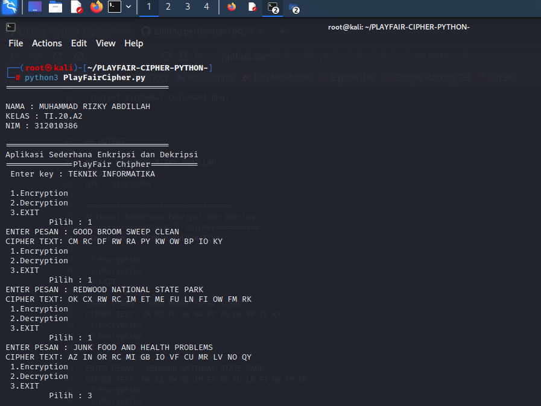

# PLAYFAIR-CIPHER-PYTHON-

| M. Rizky Abdillah     |       312010386       |
|-----------------------|-----------------------|
|    TI.20.A.2          |     KRIPTOGRAFI       |
|   PERTEMUAN 6         |   PlayFair-Cipher     |

## Penjelasan tentang PLAYFAIR CHIPHER
```
Metode Playfair Cipher
square adalah teknik enkripsi simetrik yang termasuk dalam sistem substitusi digraph. 
dipecahkan jika dibandingkan dengan sistem substitusi sederhana seperti caesar atau viginere.

DECRYPT SANDI 
Dekripsi adalah proses mengubah kata sandi (cipherteks) menjadi kata terang (plainteks). 
Proses dekripsi sangat mirip dengan proses enkripsi dan lebih mudah dilakukan. Untuk melakukan proses dekripsi, 
cipherteks dikelompokkan terlebih dahulu dalam pasangan huruf seperti pada saat enkripsi, kemudian menggunakan 
algoritme dekripsi yang merupakan kebalikan dari algoritme enkripsi untuk setiap pasangan huruf tersebut. 
```
## OUTPUT CAPTURE Hasil Enkripsi dan dekripsi

Soal Lakukan Enkripsi pada Plaintext 
  * GOOD BROOM SWEEP CLEAN
  * REDWOOD NATIONAL STATE PARK
  * JUNK FOOD AND HEALTH PROBLEMS
  
Tools yang saya pake yaitu : 
  * KALI LINUX
  * PYTHON 3
## Hasil enkripsi
* disini saya melakukan enkripsi dengan python3
1. Buka terlebih dahulu tools file yang sudah anda buat dengan sintax kali linux
```
cd/PlayFair-Cipher
python3 /PlayFair-Cipher
```
dengan hasil gambar seperti dibawah ini


2. Setelah itu kita jalankan tools nya yaitu kita pilih enkripsi no 1



Sukses data terenkripsi ...

```
GOOD BROOM SWEEP CLEAN
>? CMRCDFRWRAPYKWOWBPIOKY 


REDWOOD NATIONAL STATE PARK
>? OKCXRWRCIMETMEFULNFIOWFMRK


JUNK FOOD AND HEALTH PROBLEMS
>? AZINORRCMIGBIOVFCUMRLVNOQY 
```

