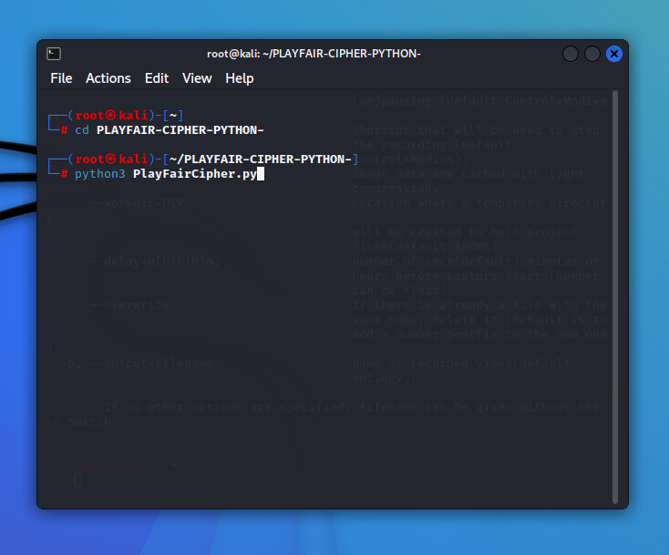

# PLAYFAIR-CIPHER-PYTHON-

| M. Rizky Abdillah     |       312010386       |
|-----------------------|-----------------------|
|    TI.20.A.2          |     KRIPTOGRAFI       |
|   PERTEMUAN 6         |   PlayFair-Cipher     |


## OUTPUT CAPTURE Hasil Enkripsi dan dekripsi

Soal Lakukan Enkripsi pada Plaintext 
  * GOOD BROOM SWEEP CLEAN
  * REDWOOD NATIONAL STATE PARK
  * JUNK FOOD AND HEALTH PROBLEMS
  
Tools yang saya pake yaitu : 
  * KALI LINUX
  * PYTHON 3
## Hasil enkripsi ialah
* disini saya melakukan enkripsi dengan python3
1. Buka terlebih dahulu tools file yang sudah anda buat dengan sintax kali linux
```
cd/PlayFair-Cipher
python3 /PlayFair-Cipher
```
dengan hasil gambar seperti dibawah ini



2. Setelah itu kita jalankan tools nya yaitu kita pilih enkripsi no 1
```


```
